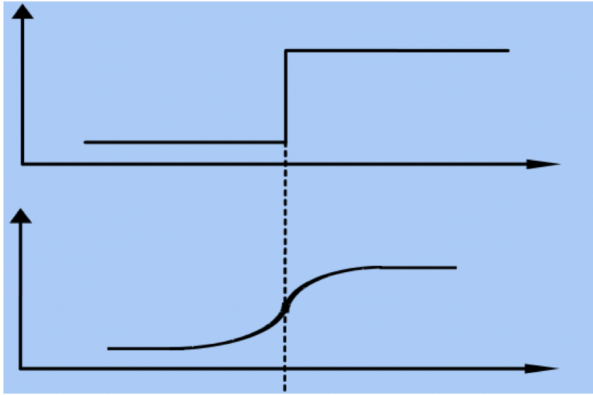
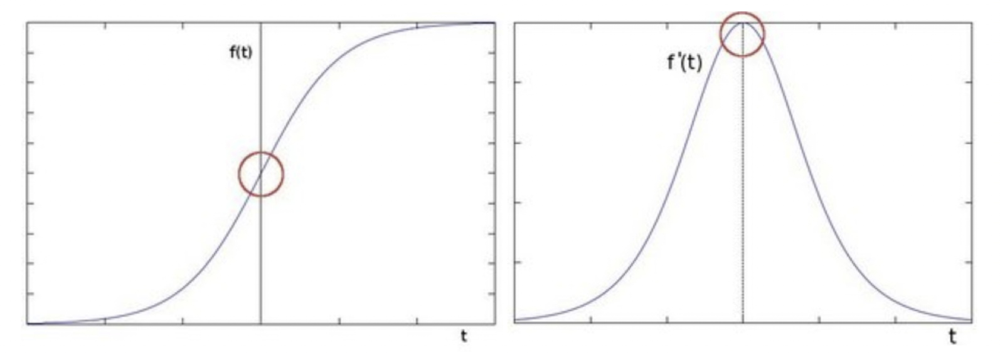
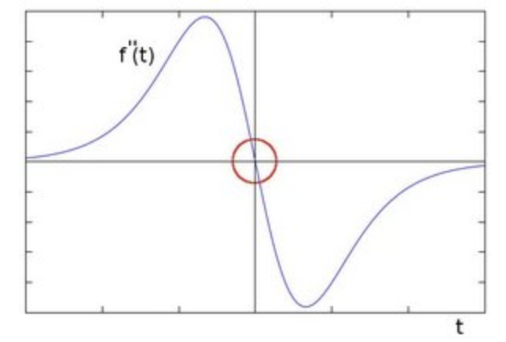
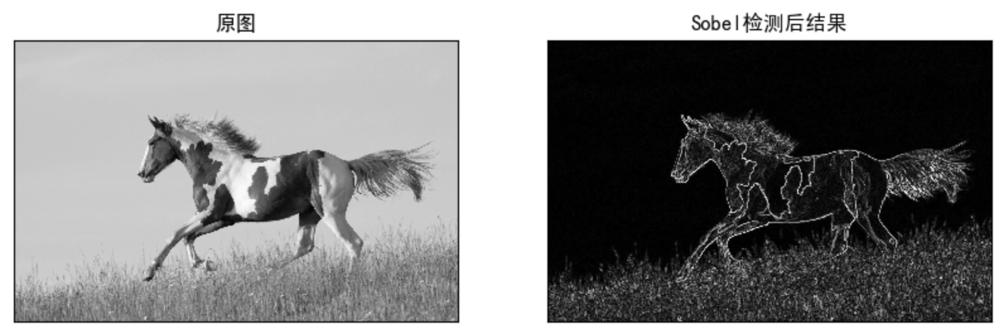
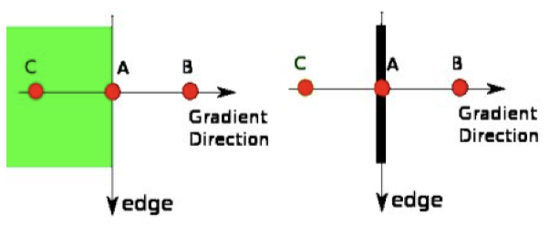
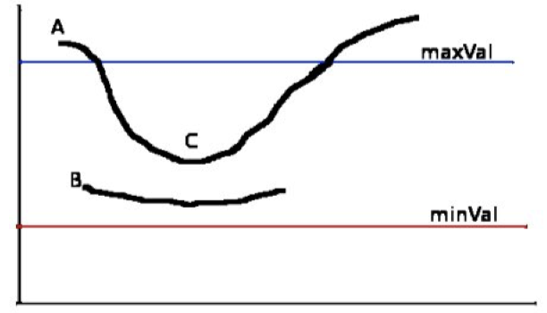
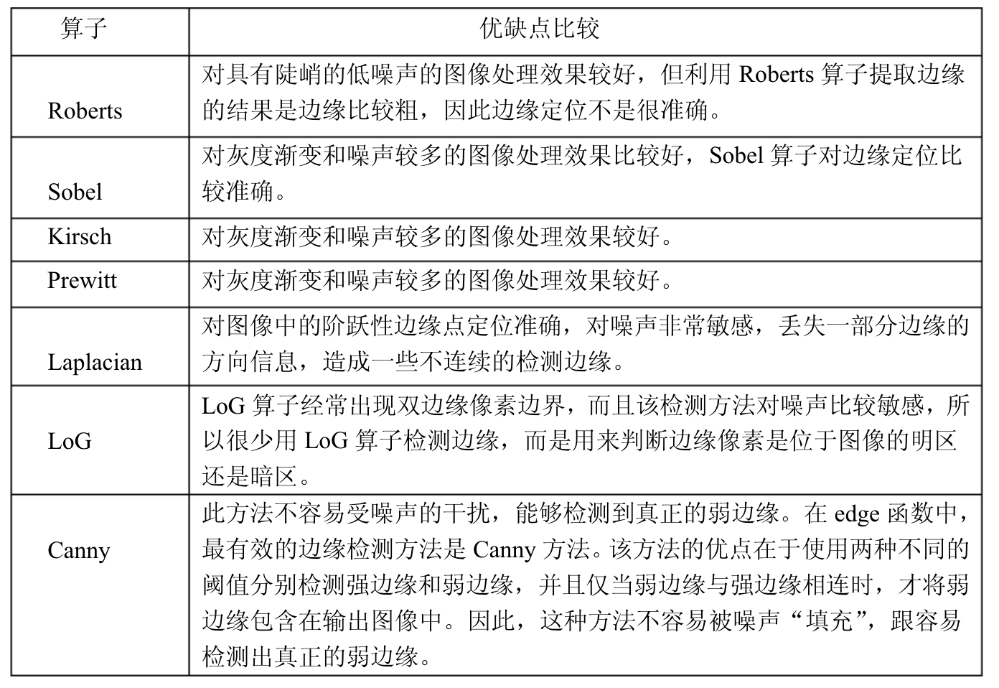

# 边缘检测

**学习目标**

- 了解Sobel算子，Scharr算子和拉普拉斯算子
- 掌握canny边缘检测的原理及应用

---

# 1 原理

边缘检测是图像处理和计算机视觉中的基本问题，边缘检测的目的是标识数字图像中亮度变化明显的点。图像属性中的显著变化通常反映了属性的重要事件和变化。边缘的表现形式如下图所示：



###### 图像边缘检测大幅度地减少了数据量，并且剔除了可以认为不相关的信息，保留了图像重要的结构属性。有许多方法用于边缘检测，它们的绝大部分可以划分为两类：**基于搜索**和**基于零穿越**。

- 基于搜索：通过寻找图像一阶导数中的最大值来检测边界，然后利用计算结果估计边缘的局部方向，通常采用梯度的方向，并利用此方向找到局部梯度模的最大值，代表算法是Sobel算子和Scharr算子。

  

- 基于零穿越：通过寻找图像二阶导数零穿越来寻找边界，代表算法是Laplacian算子。

  

# 2 Sobel检测算子

Sobel边缘检测算法比较简单，实际应用中效率比canny边缘检测效率要高，但是边缘不如Canny检测的准确，但是很多实际应用的场合，sobel边缘却是首选，Sobel算子是高斯平滑与微分操作的结合体，所以其抗噪声能力很强，用途较多。尤其是效率要求较高，而对细纹理不太关心的时候。

## 2.1 方法

对于不连续的函数，一阶导数可以写作：
$$
f'(x)= f(x)-f(x-1)
$$
或
$$
f'(x)= f(x+1)-f(x)
$$
所以有：
$$
f'(x) = \frac{f(x+1)-f(x-1)}{2}
$$
假设要处理的图像为$$I$$，在两个方向求导:

-  **水平变化**: 将图像$$I$$ 与奇数大小的模版进行卷积，结果为$$G_x$$。比如，当模板大小为3时, $$G_x$$为:
  $$
  G_x=\left[\begin{matrix}-1&0&+1\\-2&0&+2\\-1&0&+1\end{matrix}\right]* I
  $$


- **垂直变化**: 将图像$$I$$与奇数大小的模板进行卷积，结果为$$G_y$$。比如，当模板大小为3时, $$G_y$$为:
  $$
  G_y = \left[\begin{matrix}-1&-2&-1\\0&0&0\\+1&+2&+1\end{matrix}\right]*I
  $$


在图像的每一点，结合以上两个结果求出：
$$
G = \sqrt{G_{x}^2+G_{y}^2}
$$
统计极大值所在的位置，就是图像的边缘。

**注意**：当内核大小为3时, 以上Sobel内核可能产生比较明显的误差， 为解决这一问题，我们使用Scharr函数，但该函数仅作用于大小为3的内核。该函数的运算与Sobel函数一样快，但结果却更加精确，其计算方法为:
$$
G_x=\left[\begin{matrix}-3&0&+3\\-10&0&+10\\-3&0&+3\end{matrix}\right]* I
$$

$$
G_y = \left[\begin{matrix}-3&-10&-3\\0&0&0\\+3&+10&+3\end{matrix}\right]*I
$$

## 2.2 应用

利用OpenCV进行sobel边缘检测的API是：

```python
Sobel_x_or_y = cv2.Sobel(src, ddepth, dx, dy, dst, ksize, scale, delta, borderType)
```

参数：

- src：传入的图像

- ddepth: 图像的深度

- dx和dy: 指求导的阶数，0表示这个方向上没有求导，取值为0、1。

- ksize: 是Sobel算子的大小，即卷积核的大小，必须为奇数1、3、5、7，默认为3。

  注意：如果ksize=-1，就演变成为3x3的Scharr算子。

- scale：缩放导数的比例常数，默认情况为没有伸缩系数。

- borderType：图像边界的模式，默认值为cv2.BORDER_DEFAULT。

Sobel函数求完导数后会有负值，还有会大于255的值。而原图像是uint8，即8位无符号数，所以Sobel建立的图像位数不够，会有截断。因此要使用16位有符号的数据类型，即cv2.CV_16S。处理完图像后，再使用cv2.convertScaleAbs()函数将其转回原来的uint8格式，否则图像无法显示。

Sobel算子是在两个方向计算的，最后还需要用cv2.addWeighted( )函数将其组合起来

```pyh
Scale_abs = cv2.convertScaleAbs(x)  # 格式转换函数
result = cv2.addWeighted(src1, alpha, src2, beta) # 图像混合
```

示例：

```python
import cv2 as cv
import numpy as np
from matplotlib import pyplot as plt
# 1 读取图像
img = cv.imread('./image/horse.jpg',0)
# 2 计算Sobel卷积结果
x = cv.Sobel(img, cv.CV_16S, 1, 0)
y = cv.Sobel(img, cv.CV_16S, 0, 1)
# 3 将数据进行转换
Scale_absX = cv.convertScaleAbs(x)  # convert 转换  scale 缩放
Scale_absY = cv.convertScaleAbs(y)
# 4 结果合成
result = cv.addWeighted(Scale_absX, 0.5, Scale_absY, 0.5, 0)
# 5 图像显示
plt.figure(figsize=(10,8),dpi=100)
plt.subplot(121),plt.imshow(img,cmap=plt.cm.gray),plt.title('原图')
plt.xticks([]), plt.yticks([])
plt.subplot(122),plt.imshow(result,cmap = plt.cm.gray),plt.title('Sobel滤波后结果')
plt.xticks([]), plt.yticks([])
plt.show()
```



将上述代码中计算sobel算子的部分中将ksize设为-1，就是利用Scharr进行边缘检测。

```Python
x = cv.Sobel(img, cv.CV_16S, 1, 0, ksize = -1)
y = cv.Sobel(img, cv.CV_16S, 0, 1, ksize = -1)
```


# 3 Laplacian算子

Laplacian是利用二阶导数来检测边缘 。 因为图像是 “*2维*”, 我们需要在两个方向求导，如下式所示：
$$
\Delta src= \frac{\partial ^{2}src}{\partial x^{2}}+ \frac{\partial ^{2}src}{\partial y^{2}}
$$
那不连续函数的二阶导数是：
$$
f''(x)=f'(x+1)-f'(x)=f(x+1)+f(x-1)-2f(x)
$$
那使用的卷积核是：
$$
kernel=\begin{bmatrix}
\ 0\ \ \ \ 1\ \ \ \ 0\\ 
\ 1\ -4\ \ 1\\ 
\ 0\ \ \ \ 1\ \ \ \ 0 
\end{bmatrix}
$$
API：

```python
laplacian = cv2.Laplacian(src, ddepth[, dst[, ksize[, scale[, delta[, borderType]]]]])
```

参数：

- Src: 需要处理的图像，
- Ddepth: 图像的深度，-1表示采用的是原图像相同的深度，目标图像的深度必须大于等于原图像的深度；
- ksize：算子的大小，即卷积核的大小，必须为1,3,5,7。

示例：

```python
import cv2 as cv
import numpy as np
from matplotlib import pyplot as plt
# 1 读取图像
img = cv.imread('./image/horse.jpg',0)
# 2 laplacian转换
result = cv.Laplacian(img,cv.CV_16S)
Scale_abs = cv.convertScaleAbs(result)
# 3 图像展示
plt.figure(figsize=(10,8),dpi=100)
plt.subplot(121),plt.imshow(img,cmap=plt.cm.gray),plt.title('原图')
plt.xticks([]), plt.yticks([])
plt.subplot(122),plt.imshow(Scale_abs,cmap = plt.cm.gray),plt.title('Laplacian检测后结果')
plt.xticks([]), plt.yticks([])
plt.show()
```


# 4 Canny边缘检测

Canny 边缘检测算法是一种非常流行的边缘检测算法，是 John F. Canny 于 1986年提出的，被认为是最优的边缘检测算法。

## 4.1 原理

Canny边缘检测算法是由4步构成，分别介绍如下：

- 第一步：噪声去除
###### 由于边缘检测很容易受到噪声的影响，所以首先使用$5*5$高斯滤波器去除噪声，在图像平滑那一章节中已经介绍过。

- 第二步：计算图像梯度

######  对平滑后的图像使用 Sobel 算子计算水平方向和竖直方向的一阶导数（Gx 和 Gy）。根据得到的这两幅梯度图（Gx 和 Gy）找到边界的梯度和方向，公式如下:

$$
Edge\_Gradient\left ( G \right )= \sqrt{G_{x}^{2}+G_{y}^{2}}
$$

$$
Angle\left ( \theta  \right )= tan^{-1}\left ( \frac{G_{y}}{G_{x}} \right )
$$

###### 	如果某个像素点是边缘，则其梯度方向总是垂直与边缘垂直。梯度方向被归为四类：垂直，水平，和两个对角线方向。

- 第三步：非极大值抑制


###### 在获得梯度的方向和大小之后，对整幅图像进行扫描，去除那些非边界上的点。对每一个像素进行检查，看这个点的梯度是不是周围具有相同梯度方向的点中最大的。如下图所示：



###### 	A点位于图像的边缘，在其梯度变化方向，选择像素点B和C，用来检验A点的梯度是否为极大值，若为极大值，则进行保留，否则A点被抑制，最终的结果是具有“细边”的二进制图像。	

- 第四步：滞后阈值


###### 现在要确定真正的边界。 我们设置两个阈值： minVal 和 maxVal。 当图像的灰度梯度高于 maxVal 时被认为是真的边界， 低于 minVal 的边界会被抛弃。如果介于两者之间的话，就要看这个点是否与某个被确定为真正的边界点相连，如果是就认为它也是边界点，如果不是就抛弃。如下图：

  

如上图所示，A 高于阈值 maxVal 所以是真正的边界点，C 虽然低于 maxVal 但高于 minVal 并且与 A 相连，所以也被认为是真正的边界点。而 B 就会被抛弃，因为低于 maxVal 而且不与真正的边界点相连。所以选择合适的 maxVal 和 minVal 对于能否得到好的结果非常重要。

## 4.2 应用

在OpenCV中要实现Canny检测使用的API:

```python
canny = cv2.Canny(image, threshold1, threshold2) 
```

参数：

- image:灰度图，
- threshold1: minval，较小的阈值将间断的边缘连接起来
- threshold2: maxval，较大的阈值检测图像中明显的边缘

示例：

```python
import cv2 as cv
import numpy as np
from matplotlib import pyplot as plt
# 1 图像读取
img = cv.imread('./image/horse.jpg',0)
# 2 Canny边缘检测
lowThreshold = 0
max_lowThreshold = 100
canny = cv.Canny(img, lowThreshold, max_lowThreshold) 
# 3 图像展示
plt.figure(figsize=(10,8),dpi=100)
plt.subplot(121),plt.imshow(img,cmap=plt.cm.gray),plt.title('原图')
plt.xticks([]), plt.yticks([])
plt.subplot(122),plt.imshow(canny,cmap = plt.cm.gray),plt.title('Canny检测后结果')
plt.xticks([]), plt.yticks([])
plt.show()
```


---

**总结**

1. 边缘检测的原理

   - 基于搜索：利用一阶导数的最大值获取边界
   - 基于零穿越：利用二阶导数为0获取边界

2. Sobel算子

   基于搜索的方法获取边界

   cv.sobel()

   cv.convertScaleAbs()

   cv.addweights()

3. Laplacian算子

   基于零穿越获取边界

   cv.Laplacian()

4. Canny算法

   流程：

   - 噪声去除：高斯滤波
   - 计算图像梯度：sobel算子，计算梯度大小和方向
   - 非极大值抑制：利用梯度方向像素来判断当前像素是否为边界点
   - 滞后阈值：设置两个阈值，确定最终的边界

5 算子比较

