# 3.8 轮廓检测

**学习目标**

- 了解图像的轮廓，知道怎么利用OPenCV查找轮廓
- 知道轮廓的特征
- 知道图像的矩特征

---

# 1 图像的轮廓

###### 轮廓可以简单认为成将连续的点（连着边界）连在一起的曲线，具有相同的颜色或者灰度。轮廓是图像目标的外部特征，这种特征对于我们进行图像分析，目标识别和理解等更深层次的处理都有很重要的意义。

###### **轮廓提取的基本原理：**对于一幅背景为黑色、目标为白色的二值图像，如果在图中找到一个白色点，且它的8邻域（或4邻域）也均为白色，则说明该点是目标的内部点，将其置为黑色，视觉上就像内部被掏空一样；否则保持白色不变，该点是目标的轮廓点。一般在寻找轮廓之前，都要将图像进行阈值化或Canny边缘检测，转换为二值化图像。

在这里我们看下边缘提取和轮廓检测的区别：

**边缘检测**主要是通过一些手段检测数字图像中明暗变化剧烈（即梯度变化比较大）像素点，偏向于图像中像素点的变化。如canny边缘检测，结果通常保存在和源图片一样尺寸和类型的边缘图中。 

**轮廓检测**指检测图像中的对象边界，更偏向于关注上层语义对象。如OpenCV中的findContours()函数， 它会得到每一个轮廓并以点向量方式存储，除此也得到一个图像的拓扑信息，即一个轮廓的后一个轮廓、前一个轮廓等的索引编号。


## 1.1 查找轮廓

在OPenCV中查找轮廓的API:

```python
binary, contours, hierarchy = cv2.findContours(img, mode, method)
```

参数：

- img: 输入图像，二值图

- mode: 轮廓的检索模式，主要有四种方式：

  cv2.RETR_EXTERNAL：只检测外轮廓，所有子轮廓被忽略

  cv2.RETR_LIST：检测的轮廓不建立等级关系，所有轮廓属于同一等级

  cv2.RETR_CCOMP：返回所有的轮廓，只建立两个等级的轮廓。一个对象的外轮廓为第 1 级组织结构。而对象内部中空洞的轮廓为 第 2 级组织结构，空洞中的任何对象的轮廓又是第 1 级组织结构。     

  cv2.RETR_TREE：返回所有的轮廓，建立一个完整的组织结构的轮廓。

- method：轮廓的近似方法，主要有以下两种：

  cv2.CHAIN_APPROX_NONE：存储所有的轮廓点，相邻的两个点的像素位置差不超过1。

  cv2.CHAIN_APPROX_SIMPLE：压缩水平方向，垂直方向，对角线方向的元素，只保留该方向的终点坐标，例如一个矩形轮廓只需4个点来保存轮廓信息。

  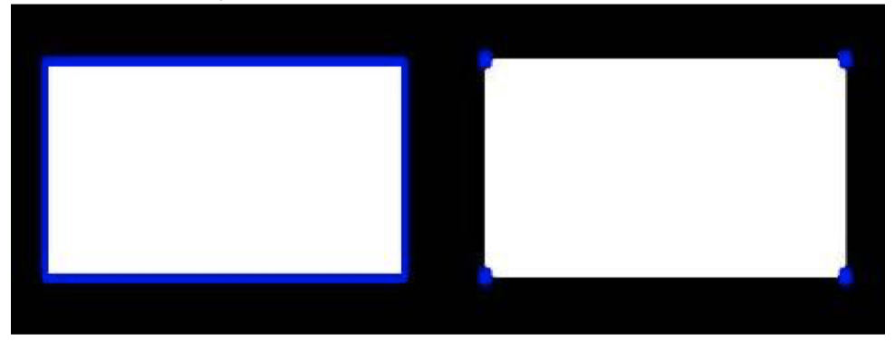

返回：

- binary: 返回的二值图像

- contours: 检测出的轮廓，所有轮廓的列表结构，每个轮廓是目标对象边界点的坐标的数组

- hierarchy：轮廓的层次结构。

  在检测轮廓时：有时对象可能位于不同的位置，也有可能一个形状在另外一个形状的内部，这种情况下我们称外部的形状为父，内部的形状为子。按照这种方式分类，一幅图像中的所有轮廓之间就建立父子关系。这样我们就可以确定一个轮廓与其他轮廓是怎样连接的，比如它是不是某个轮廓的子轮廓，或者是父轮廓。这种关系就是轮廓的层次关系。

  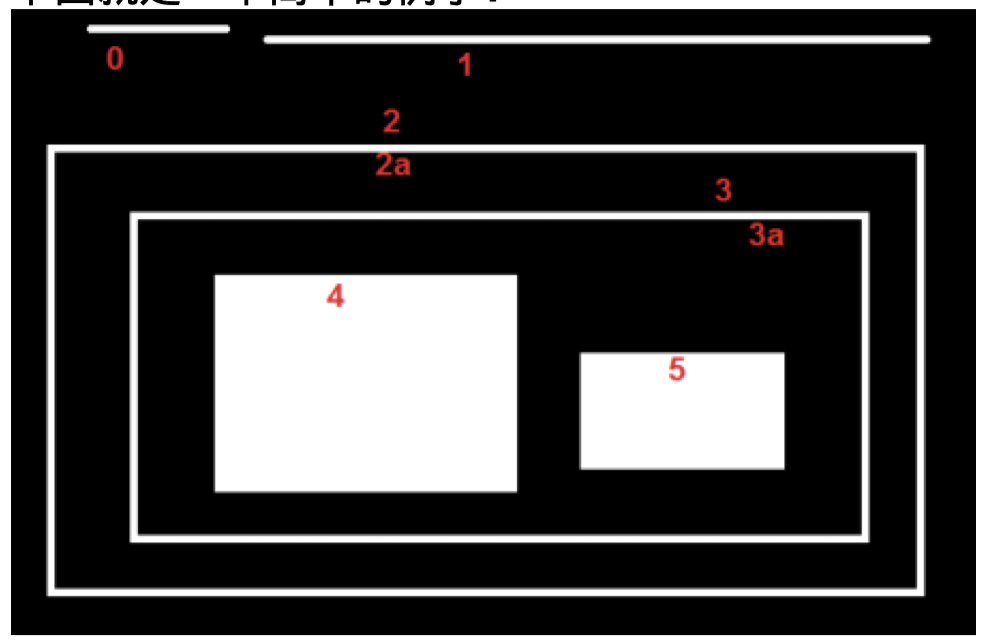

  在这幅图像中，我给这几个形状编号为 0-5。2 和 2a 分别代表最外边矩形的外轮廓和内轮廓。

  在这里边轮廓 0，1，2 在外部或最外边。我们可以称他们为 0 级，简单来说就是他们属于同一级，接下来轮廓 2a，把它当成轮廓 2 的子轮廓。它就成为第 1 级。轮廓 3 是轮廓 2a 的子轮廓，成为第 3 级。轮廓 3a 是轮廓 3 的子轮廓，成为第 4 级,最后轮廓 4,5 是轮廓 3a 的子轮廓，成为5级，这样我们就构建的轮廓的层级关系。

  我们再回到返回值中，不管层次结构是什么样的， 每一个轮廓都包含自己的信息。hierarchy使用包含四个元素的数组来表示：

  **[Next，Previous， First_Child，Parent]**。

  其中：

  **Next** 表示同一级组织结构中的下一个轮廓，

  以上图中的轮廓 0 为例，轮廓 1 就是他的 Next。同样，轮廓 1 的 Next 是 2，Next=2。 那轮廓 2 呢？在同一级没有 Next。这时 Next=-1。而轮廓 4 的 Next 为 5，所以它的 Next=5。

   **Previous** 表示同一级结构中的前一个轮廓。 

  轮廓 1 的 Previous 为轮廓 0，轮廓 2 的 Previous 为轮 廓 1。轮廓 0 没有 Previous，所以 Previous=-1。

  **First_Child** 表示它的第一个子轮廓。 

  轮廓 2 的子轮廓为 2a。 所以它的 First_Child 为 2a。那轮廓 3a 呢？它有两个子轮廓。但是我们只要第一个子轮廓，所以是轮 廓 4（按照从上往下，从左往右的顺序排序）。

   **Parent** 表示它的父轮廓。 

  与 First_Child 刚好相反。轮廓 4 和 5 的父轮廓是轮廓 3a。而轮廓 3a 的父轮廓是 3。

  **注意：**如果轮廓没有父轮廓或子轮廓时，则将其置为-1。

## 1.2 绘制轮廓

我们查找到图像中的轮廓后，怎么将他绘制在图像上呢？

```python
cv2.drawContours(img, contours, index, color, width)
```

参数：

- img: 轮廓检测的原图像
- contours: 检测出的轮廓。
- Index: 轮廓的索引，绘制单个轮廓时指定其索引，绘制全部的轮廓时设为-1即可。
- color和width: 绘制时轮廓的颜色及线型的宽度。

示例：

在北京市的图片上进行轮廓检测，如下图所示：

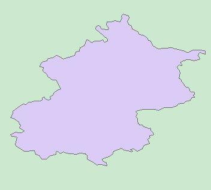

```python
import numpy as np
import cv2 as cv
import matplotlib.pyplot as plt
# 1 图像读取
img = cv.imread('beijing.jpg') 
imgray = cv.cvtColor(img,cv.COLOR_BGR2GRAY)
# 2 边缘检测
canny = cv.Canny(imgray,127,255,0)
# 3 轮廓提取
image, contours, hierarchy = cv.findContours(canny,cv.RETR_TREE,cv.CHAIN_APPROX_NONE)
# 4 将轮廓绘制在图像上
img = cv.drawContours(img, contours, -1, (0,0,255), 2)
# 5 图像显示
plt.imshow(img[:,:,::-1])
plt.xticks([]), plt.yticks([])
plt.show()
```

检测结果如下图所示：

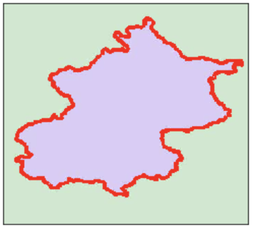

# 2 轮廓的特征

在提取了图像的轮廓后，可以计算轮廓的不同特征，我们现在主要看下：轮廓的面积，周长，边界框等。

## 2.1 轮廓面积

轮廓面积是轮廓所包围的区域的面积，在OpenCV中使用的API是：

```python
area = cv.contourArea(cnt)
```

## 2.2 轮廓周长

轮廓周长也被成为弧长，在OpenCV中使用的API是：

```python
perimeter = cv2.arcLength(cnt,isclosed)
```

参数：

- Isclosed: 指定轮廓的形状是闭合的（True），还是开放的。

## 2.3 轮廓近似

轮廓近似是将轮廓形状近似为到另外一种由更少点组成的轮廓形状，新轮廓的点的数目由我们设定的准确度来决定。

假设我们要在一幅图像中查找一个矩形，然而这个图凹凸不平，直接提取轮廓无法提取到一个完美的矩形。因此我们就可以使用轮廓近似函数来近似这个形状了。

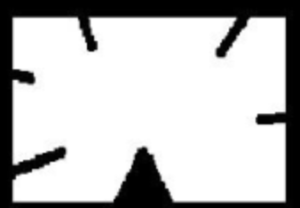

 在OpenCV中使用的API是:

```python
approx = cv.approxPolyDP(cnt,epsilon,isclosed)
```

参数：

- cnt: 要进行轮廓近似的原始轮廓
- epsilon:从原始轮廓到近似轮廓的最大距离，是一个准确度参数，该参数对调整后的结果很重要。
- Isclosed: 指定轮廓是否闭合

返回：

- approx: 返回的点集，绘制时将其连接起来绘制最终的近似轮廓。

示例：

```python
import numpy as np
import cv2 as cv
import matplotlib.pyplot as plt
# 1 图像读取
img = cv.imread('rec.png') 
imgray = cv.cvtColor(img,cv.COLOR_BGR2GRAY)
# 2 转换为二值图
ret,thresh = cv.threshold(imgray,127,255,0)
# 3 轮廓提取
image, contours, hierarchy = cv.findContours(thresh,cv.RETR_LIST,cv.CHAIN_APPROX_NONE)
# 4 轮廓近似
epsilon = 0.1*cv.arcLength(contours[0],True)
approx = cv.approxPolyDP(contours[0],epsilon,True)
# 5 将轮廓绘制在图像上
# 5.1 原始轮廓
img1 = cv.drawContours(img, contours, -1, (0,0,255), 2)
# 5.2 轮廓近似后的结果
img2 = cv.polylines(img, [approx], True, (0, 0, 255), 2)

# 6 图像显示
plt.figure(figsize=(10,8),dpi=100)
plt.subplot(121),plt.imshow(img[:,:,::-1]),plt.title('轮廓检测结果')
plt.xticks([]), plt.yticks([])
plt.subplot(122),plt.imshow(img[:,:,::-1]),plt.title('轮廓近似后结果')
plt.xticks([]), plt.yticks([])
plt.show()
```

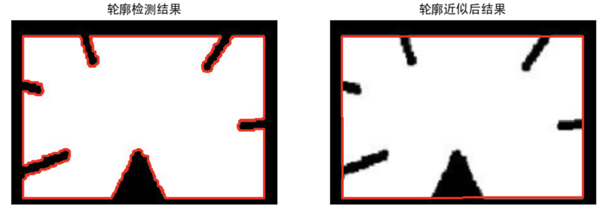

## 2.4 凸包

凸包是计算机几何图形学中的概念，简单来说，给定二维平面点集，凸包就是将最外层的点连接起来构成的凸多边形，他能够包含物体中所有的点。物体的凸包常应用在物体识别，手势识别及边界检测等领域。

在OpenCV中检测凸包的API是：

```python
hull = cv2.convexHull(points,  clockwise, returnPoints)
```

参数：

- points: 传入的轮廓
- clockwise: 方向标志。如果设置为 True，输出的凸包是顺时针方向的。 否则为逆时针方向
- returnPoints 默认值为 True。它会返回凸包上点的坐标。 如果设置 为 False，就会返回与凸包点对应的轮廓上的点的索引。

返回：

- hull: 输出的凸包结果

示例：

我们检测一个五角星的凸包结果，代码如下：

```python
import numpy as np
import cv2 as cv
import matplotlib.pyplot as plt
# 1 图像读取
img = cv.imread('star.jpeg') 
img1 =img.copy()
imgray = cv.cvtColor(img,cv2.COLOR_BGR2GRAY)
# 2 边缘检测
canny = cv.Canny(imgray,127,255,0)
# 3 轮廓提取
image, contours, hierarchy = cv.findContours(canny,cv2.RETR_TREE,cv2.CHAIN_APPROX_NONE)
# 4 将轮廓绘制在图像上
img = cv.drawContours(img, contours, 1, (255,0,0), 2)

# 5 凸包检测
hulls=[]
for cnt in contours:
    # 寻找凸包使用cv2.convexHull(contour)
    hull = cv.convexHull(cnt)
    hulls.append(hull)
draw_hulls = cv.drawContours(img1,hulls, -1, (0, 255, 0), 2)
    
# 5 图像显示
plt.figure(figsize=(10,8),dpi=100)
plt.subplot(121),plt.imshow(img[:,:,::-1]),plt.title('轮廓检测结果')
plt.xticks([]), plt.yticks([])
plt.subplot(122),plt.imshow(draw_hulls[:,:,::-1]),plt.title('凸包结果')
plt.xticks([]), plt.yticks([])
plt.show()
```

检测结果：
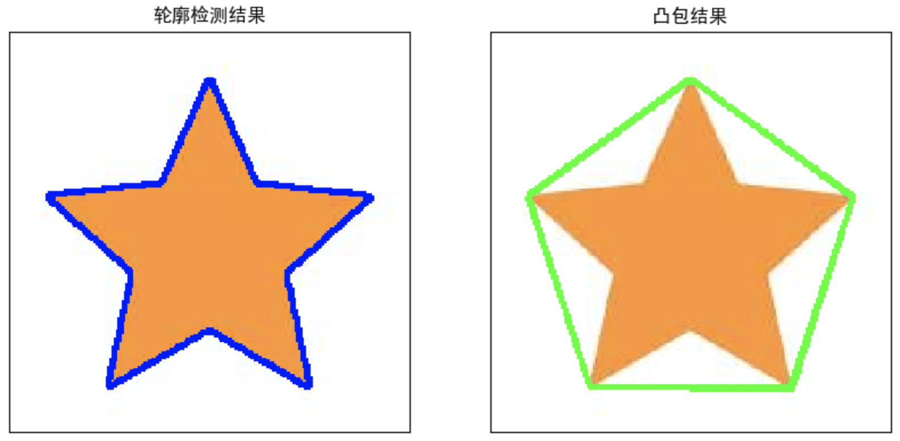

## 2.5 边界矩形

轮廓检测中的边界矩形有两种，一种是直边界矩形，一种是旋转边界矩形，分别介绍如下：

**直边界矩形** ：一个直矩形，没有进行旋转。它不会考虑对象是否旋转，所以该边界矩形的面积不是最小的。可以使用函数cv2.boundingRect()查找得到的。

```python
x,y,w,h = cv2.boundingRect(cnt)
　　img = cv2.rectangle(img,(x,y),(x+w,y+h),(0,255,0),2)
```

 　　返回值中，(x,y)是矩阵左上角的坐标，(w,h)是举行的宽和高。

**旋转边角矩形** :这个边界矩形是面积最小的，他考虑了对象的旋转。用函数cv2.minAreaRect(),返回的是一个Box2D结构，其中包含矩形左上角角点的坐标(x,y)，以及矩形的宽和高(w,h)，以及旋转角度。但是要绘制这个矩形需要矩形的4个角点。可以通过函数cv2.boxPoints()获得。

```python
s = cv2.minAreaRect(cnt)
a = cv2.boxPoints(s)
a = np.int0(a)#必须转换a的类型为int型
cv2.polylines(im,[a],True,(0,0,255),3)
```

示例：

我们找到以下图形的边界矩形：

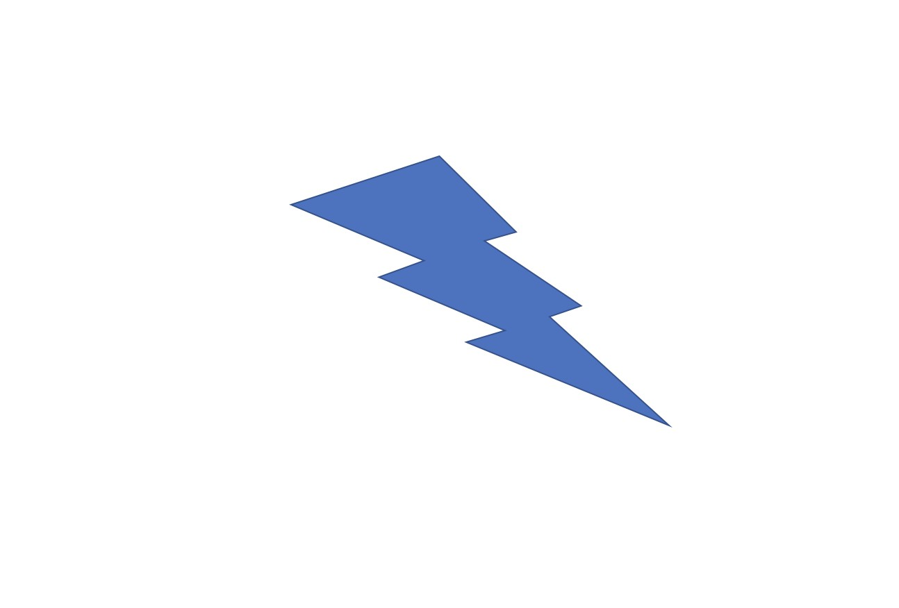

代码如下：

```python
import numpy as np
import cv2 as cv
import matplotlib.pyplot as plt
# 1 图像读取
img = cv.imread('./image/arrows.jpg') 
imgray = cv.cvtColor(img,cv2.COLOR_BGR2GRAY)
# 2 转换为二值图
ret,thresh = cv2.threshold(imgray,127,255,0)
# 3 轮廓提取
image, contours, hierarchy = cv.findContours(thresh,1,2)
# 4 将轮廓绘制在图像上
#img = cv.drawContours(img, contours, 1, (0,0,255), 2)
cnt = contours[1]
# 5 边界矩形
# 5.1 直边界矩形
x,y,w,h = cv.boundingRect(cnt)
img = cv.rectangle(img,(x,y),(x+w,y+h),(0,255,0),3)
# 5.2 旋转边界矩形结果
s = cv.minAreaRect(cnt)
a = cv.boxPoints(s)
a = np.int0(a)#转换a的类型为int型
cv.polylines(img,[a],True,(0,0,255),3)
    
# 5 图像显示
plt.figure(figsize=(10,8),dpi=100)
plt.imshow(img[:,:,::-1]),plt.title('矩形结果')
plt.xticks([]), plt.yticks([])
plt.show()
```

检测结果如下所示：其中红色的是旋转边界矩形的结果，绿色的为直边界矩形的结果

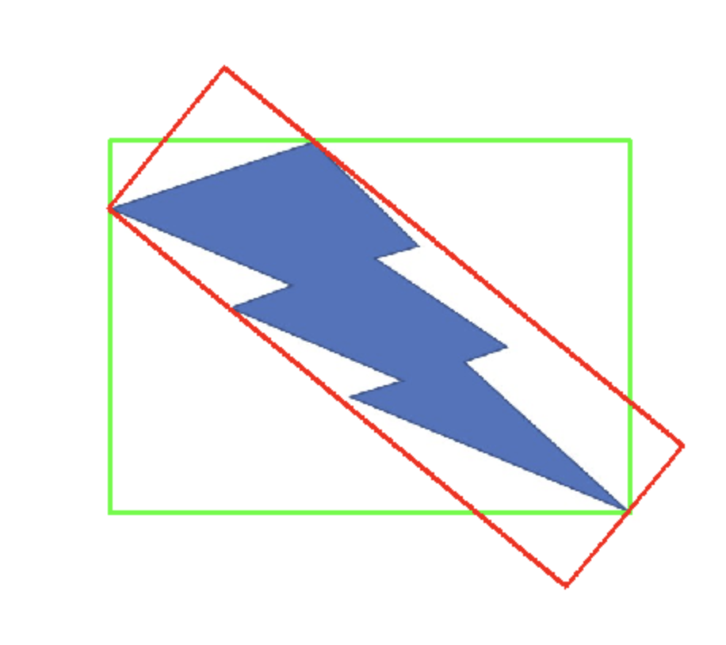

## 2.6 最小外接圆

最小外接圆是对象的外切圆，它是所有包含目标对象的圆中面积最小的一个，我们使用函数cv2.minEnclosingCircle()获取最小外接圆。

将上述案例中的边界矩形的代码改为如下所示，即可检测对象的最小外接圆

```python
(x,y),radius = cv2.minEnclosingCircle(cnt)
center = (int(x),int(y)) 
radius = int(radius) 
img = cv2.circle(img,center,radius,(0,255,0),2)
```

检测结果如下所示：
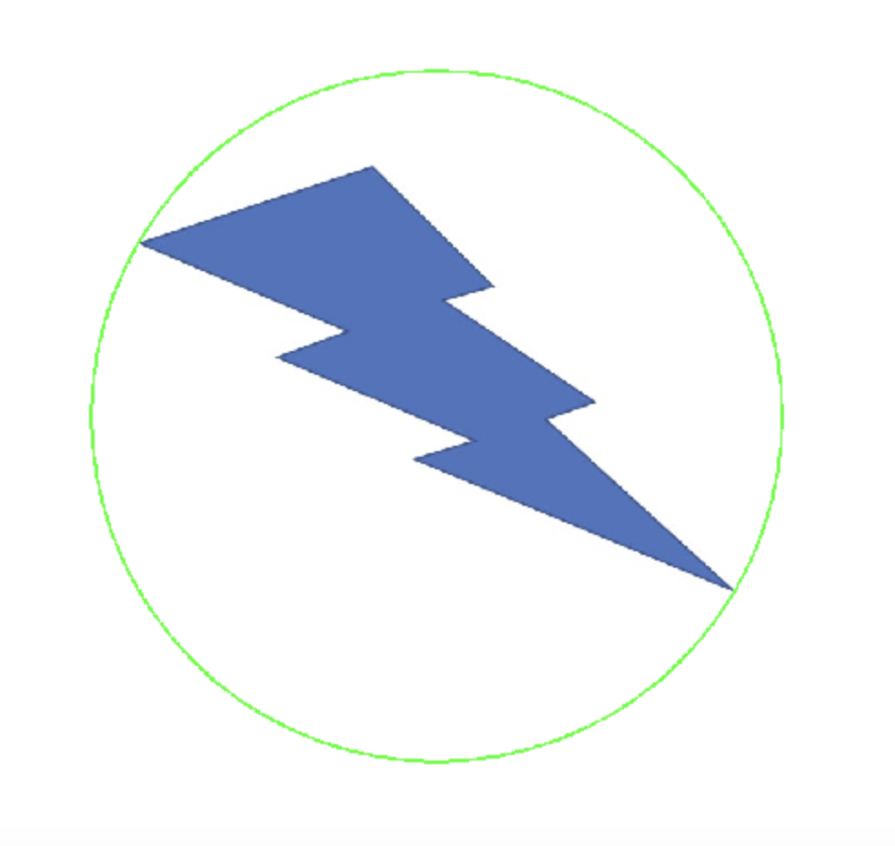

## 2.7 椭圆拟合

椭圆拟合法的基本思路是：对于给定平面上的一组样本点，寻找一个椭圆，使其尽可能接近这些样本点。也就是说，将图像中的一组数据以椭圆方程为模型进行拟合，使某一椭圆方程尽量满足这些数据，并求出该椭圆方程的各个参数。

就椭圆拟合而言，就是先假设椭圆参数，得到每个待拟合点到该椭圆的距离之和，也就是点到假设椭圆的误差，求出使这个和最小的参数。

在OPenCV中我们使用cv2.ellipse()来进行椭圆拟合，将边界矩形中的代码改为如下所示，就可得到椭圆拟合的结果：

```python
ellipse = cv.fitEllipse(cnt)
img = cv.ellipse(img,ellipse,(0,255,0),2)
```

结果如下所示：
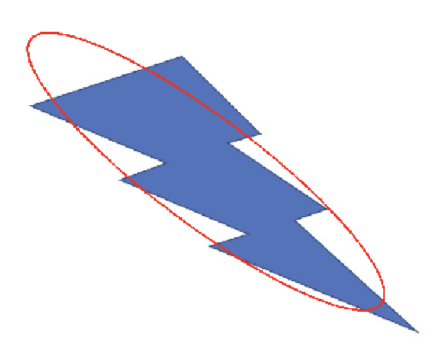

## 2.8 直线拟合

直线拟合就是将图像中的对象拟合成一条直线过程，在OPenCV中拟合直线的API是：

```python
output = cv2.fitLine(points, distType, param, reps, aeps)
```

参数：

- points: 待拟合直线的点的集合，可以是检测处理轮廓结果

- distype: 距离公式，在进行拟合是，要使输入点到拟合直线的距离之和最小，常用的用以下几种：

  cv2.DIST_L1: 曼哈顿距离

  cv2.DIST_L2: 欧式距离

   cv2.DIST_C:切比雪夫距离

- param: 距离参数，可以设为0

- Reps,aeps:用于表示拟合曲线所需要的径向和角度精度，通常设为0.01

返回：

- output: [vx,vy,x,y]的1*4 的数组，前两个表示直线的方向，即vy/vx表示斜率，后两位表示直线上的一个点。

将边界矩形中的代码改为如下示，即可进行直线拟合：

```python
rows,cols = img.shape[:2]
[vx,vy,x,y] = cv.fitLine(cnt, cv2.DIST_L2,0,0.01,0.01)
lefty = int((-x*vy/vx) + y)
righty = int(((cols-x)*vy/vx)+y)
im = cv.line(img,(cols-1,righty),(0,lefty),(0,255,0),2)
```

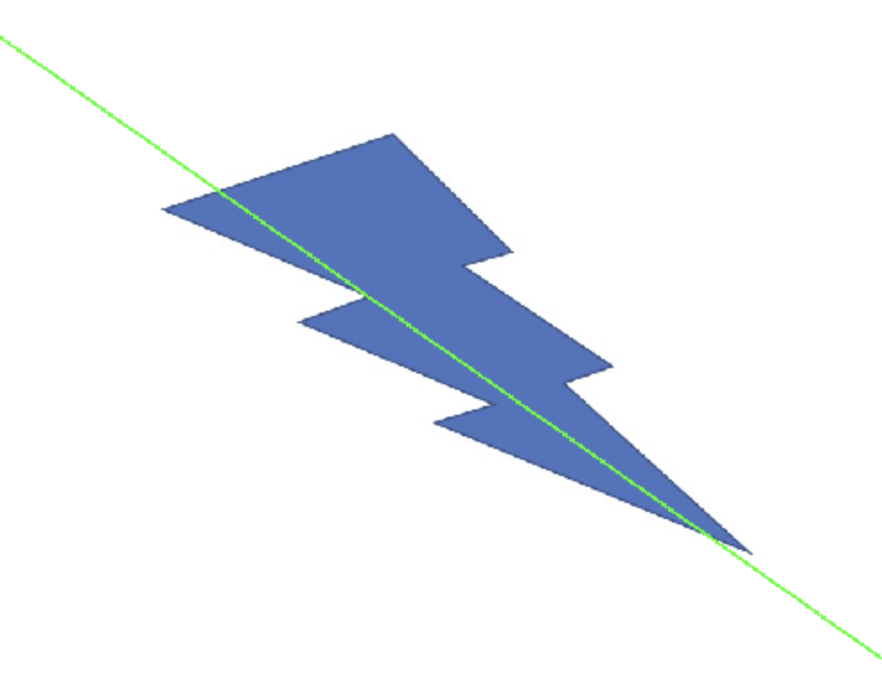

# 3 图像的矩特征

###### 矩函数在图像分析中有着广泛的应用，如模式识别、目标分类、目标识别与方位估计、图像的编码与重构等。从一幅图像计算出来的矩集，不仅可以描述图像形状的全局特征，而且可以提供大量关于该图像不同的几何特征信息，如大小，位置、方向和形状等。

## 3.1 矩的概念

###### 矩是概率与统计中的一个概念，是随机变量的一种数字特征。矩的定义如下：

设𝑋为随机变量，𝑐为常数，𝑘为正整数。则量 $$ E[( x-c)^{k}]$$ 称为𝑋关于𝑐点的𝑘阶矩。

比较重要的有两种情况：

1. 𝑐=0。这时$$ a_{k}=E(X^{k})$$称为𝑋的𝑘阶原点矩

2. 𝑐=E(𝑋)。这时$$\mu_{k}=E[( X-EX)^{k}]$$ 称为𝑋的𝑘阶中心矩。

其中，一阶原点矩就是期望。一阶中心矩μ1=0，二阶中心矩𝜇2就是𝑋的方差𝑉𝑎𝑟(𝑋)。在统计学上，高于4阶的矩极少使用。𝜇3可以去衡量分布是否有偏。𝜇4可以去衡量分布（密度）在均值附近的陡峭程度如何。

## 3.2 图像中的矩特征

**对于一幅图像，我们把像素的坐标看成是一个二维随机变量(𝑋,𝑌)，那么一幅灰度图像可以用二维灰度密度函数来表示，因此可以用矩来描述灰度图像的特征。**

1. 空间矩/几何矩

   空间矩的实质是图像的质量。计算公式如下所示：
   $$
   m_{pq}=\sum_{x,y}x^py^qI(x,y)
   $$
   其中，p和q指空间矩的阶数，I(x,y)是对应位置的灰度值。

   可以通过一阶矩和0阶矩计算图像的重心：
   $$
   C=(\frac{m_{10}}{m_{00}},\frac{m_{01}}{m_{10}})
   $$

2. 中心矩

   中心矩体现的是图像强度的最大和最小方向，具有平移不变性，计算方法如下式所示：
   $$
   mu_{pq}=\sum_{x,y}(x-\overline x)^p(y-\overline y)^qI(x,y)
   $$

3. 归一化的中心矩

   归一化的中心矩具有尺度不变性和平移不变性，计算方法如下示：
   $$
   \eta_{pq} = \frac {mu_{pq}}{m_{00}^{(p+q)/2+1}}
   $$

4. Hu矩

   Hu矩是由Hu在1962年提出的，具有平移、旋转和尺度不变性，Hu利用二阶和三阶中心矩构建了七个不变矩，具体定义如下：

   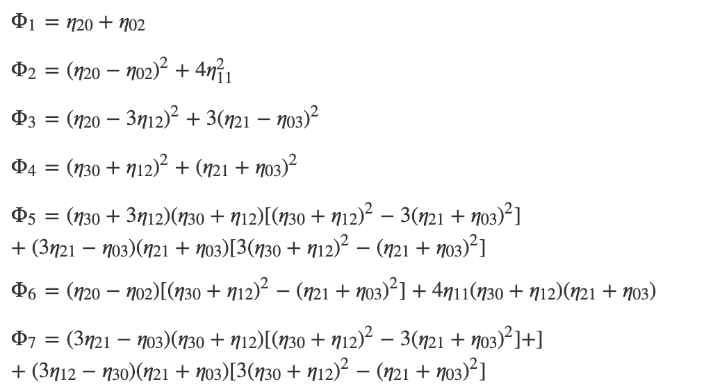


在OpenCV中有直接计算图像矩的API，分为两个函数：moments()函数用于计算中心矩，HuMoments函数用于由中心矩计算Hu矩。

```python
moments(array, binaryImage=false )
```

参数：

- array:输入数组，也可以是灰度图像，也可以是二维数组，例如提取的轮廓结果。
- BinaryImage:默认是false，若为True，则所有非零的像素都会按值1对待，也就是说相当于对图像进行了二值化处理，阈值为1，此参数仅对图像有效。

返回：

- moment: 返回数组的中心矩

计算Hu矩时，将中心距输入即可。

示例：

计算上一章节中箭头的矩特征，代码如下所示：

```python
import numpy as np
import cv2 as cv
import matplotlib.pyplot as plt
# 1 图像读取
img = cv.imread('./image/arrows.jpg') 
imgray = cv.cvtColor(img,cv.COLOR_BGR2GRAY)
# 2 计算图像的Hu矩
imgmn = cv.moments(imgray)
imghu = cv.HuMoments(imgmn)
print("图像Hu矩结果：\n",imghu)
# 3 计算轮廓的Hu矩
# 3.1 转换为二值图
ret,thresh = cv.threshold(imgray,127,255,0)
# 3.2 轮廓提取
image, contours, hierarchy = cv.findContours(thresh,1,2)
# 3.3 计算轮廓的Hu矩
cnt = contours[1]
mn = cv.moments(cnt)
hu = cv.HuMoments(mn)
print("Hu矩结果：\n",hu)
```

矩特征结果：
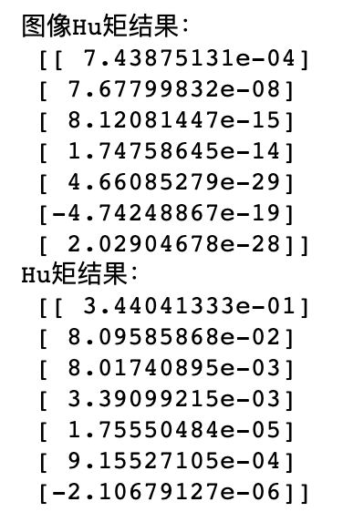

Hu矩常常作为描述图像的特征，训练分类器，来进行目标识别。

---

**总结**

1. 图像的轮廓

   轮廓是图像目标的外部特征，是具有相同的颜色或者灰度的连续点连成的曲线。

   查找轮廓：cv.findContours()

   **注意**：轮廓的检索方式，近似方式以及轮廓的层次

   绘制轮廓：cv.drawContours()

2. 轮廓的特征

   面积：ContourArea()

   周长：ArcLength() 

   轮廓近似：approxPolyDP() 逼近图像的多边形曲线

   凸包：ConvexHull()

   边界矩形：BoundingRect()和MinAreaRect() 

   最小外接圆：MinEnclosingCircle()

   椭圆拟合：fitEllipse()

   直线拟合：fitline()

3. 图像的矩特征

   矩是统计与概率中的概念

   在图像中的应用：空间矩，中心矩，Hu矩

   API： moments()

   	HuMoments()

