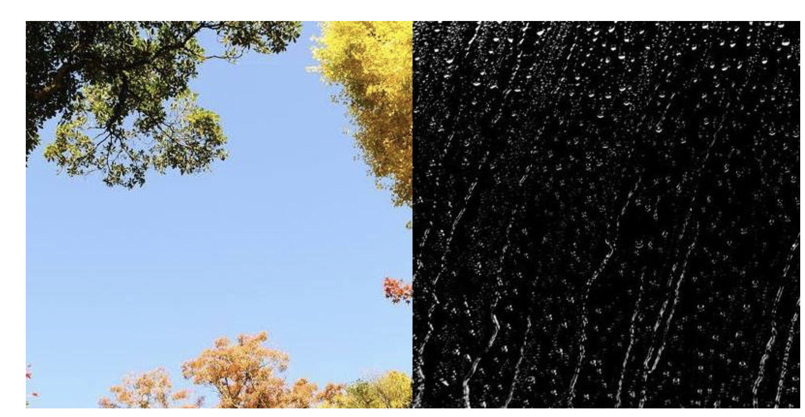
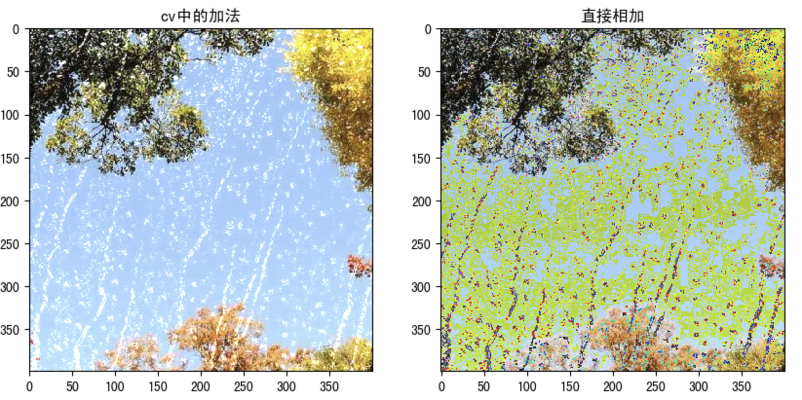
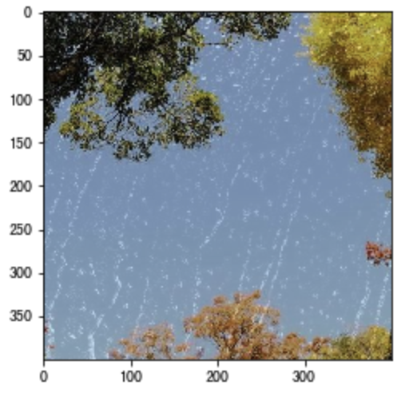

# 算数操作

**学习目标**

- 了解图像的加法、混合操作

# 1.图像的加法

你可以使用OpenCV的cv.add()函数把两幅图像相加，或者可以简单地通过numpy操作添加两个图像，如res = img1 + img2。两个图像应该具有相同的大小和类型，或者第二个图像可以是标量值。

**注意：OpenCV加法和Numpy加法之间存在差异。OpenCV的加法是饱和操作，而Numpy添加是模运算。**

参考以下代码：

```python
>>> x = np.uint8([250])
>>> y = np.uint8([10])
>>> print( cv.add(x,y) ) # 250+10 = 260 => 255
[[255]]
>>> print( x+y )          # 250+10 = 260 % 256 = 4
[4]
```

这种差别在你对两幅图像进行加法时会更加明显。OpenCV 的结果会更好一点。所以我们尽量使用 OpenCV 中的函数。

我们将下面两幅图像：



代码：

```python
import numpy as np
import cv2 as cv
import matplotlib.pyplot as plt

# 1 读取图像
img1 = cv.imread("view.jpg")
img2 = cv.imread("rain.jpg")

# 2 加法操作
img3 = cv.add(img1,img2) # cv中的加法
img4 = img1+img2 # 直接相加

# 3 图像显示
fig,axes=plt.subplots(nrows=1,ncols=2,figsize=(10,8),dpi=100)
axes[0].imshow(img3[:,:,::-1])
axes[0].set_title("cv中的加法")
axes[1].imshow(img4[:,:,::-1])
axes[1].set_title("直接相加")
plt.show()
```

结果如下所示：



# 2.图像的混合

这其实也是加法，但是不同的是两幅图像的权重不同，这就会给人一种混合或者透明的感觉。图像混合的计算公式如下：

> g(x) = (1−α)f0(x) + αf1(x)

通过修改 α 的值（0 → 1），可以实现非常炫酷的混合。

现在我们把两幅图混合在一起。第一幅图的权重是0.7，第二幅图的权重是0.3。函数cv2.addWeighted()可以按下面的公式对图片进行混合操作。

> dst = α⋅img1 + β⋅img2 + γ

这里γ取为零。

参考以下代码：

```python
import numpy as np
import cv2 as cv
import matplotlib.pyplot as plt

# 1 读取图像
img1 = cv.imread("view.jpg")
img2 = cv.imread("rain.jpg")

# 2 图像混合
img3 = cv.addWeighted(img1,0.7,img2,0.3,0)

# 3 图像显示
plt.figure(figsize=(8,8))
plt.imshow(img3[:,:,::-1])
plt.show()
```

窗口将如下图显示：



---

**总结**

1. 图像加法：将两幅图像加载一起

   cv.add()

2. 图像的混合：将两幅图像按照不同的比例进行混合

   cv.addweight()

注意：这里都要求两幅图像是相同大小的。