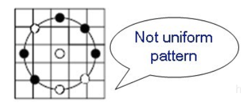
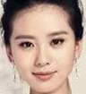
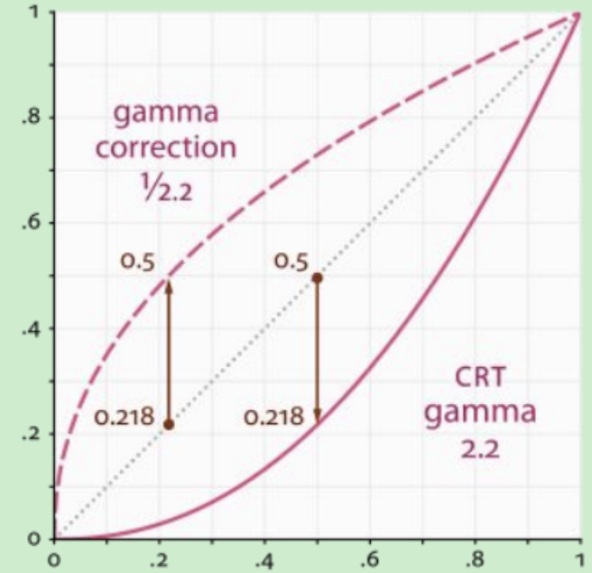
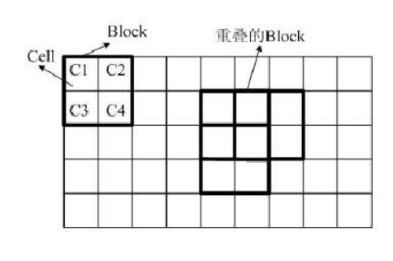

# 4.5 LBP和HOG特征算子

**学习目标**：

1. 了解LBP特征的原理
2. 了解LBP的改进算法：圆形LBP，旋转LBP和等价模式
3. 了解HOG算法的原理
4. 熟悉灰度图像的γ变换
5. 了解HOG特征的提取流程
6. 了解LBP特征的提取方法
7. 了解HOG特征的提取方法

---

# 1.LBP算法

LBP(Local Binary Pattern)指局部二值模式，是一种用来描述图像局部特征的算子，LBP特征具有灰度不变性和旋转不变性等显著优点。它是由T. Ojala, M.Pietikäinen, 和 D. Harwood在1994年提出，由于LBP特征计算简单、效果较好，因此LBP特征在计算机视觉的许多领域都得到了广泛的应用。

## 1.1 LBP特征描述

###### 原始的LBP算子定义为在$3*3$的窗口内，以窗口中心像素为阈值，将相邻的8个像素的灰度值与其进行比较，若周围像素值大于中心像素值，则该像素点的位置被标记为1，否则为0。这样，$3*3$邻域内的8个点经比较可产生8位二进制数（通常转换为十进制数即LBP码，共256种），即得到该窗口中心像素点的LBP值，并用这个值来反映该区域的纹理信息。如下图所示：


LBP值是从左上角像素，顺时针旋转得到的结果，如下图所示：


用公式来进行定义如下所示：
$$
LBP(x_c,y_c)=\sum_{p=0}^{p-1}2^ps(i_p-i_c)
$$
其中，$$(x_c,y_c)$$表示$$3*3$$邻域内的中心元素，它的像素值为$$i_c$$，$$i_p$$代表邻域内其他像素的值。s(x)是符号函数，定义如下：
$$
s(x)=\begin{cases}1,&if&x>0\\0,&else\end{cases}
$$
对于一幅大小为$$W*H$$ 的图像，因为边缘的像素无法计算8位的LBP值，所以将LBP值转换为灰度图像时，它的大小是$$(W-2)*(H-2)$$。

 LBP算子利用了周围点与该点的关系对该点进行量化。量化后可以**更有效地消除光照对图像的影响**。只要光照的变化不足以改变两个点像素值之间的大小关系，那么LBP算子的值不会发生变化，**所以一定程度上，基于LBP的识别算法解决了光照变化的问题，**但是当图像光照变化不均匀时，各像素间的大小关系被破坏，对应的LBP模式也就发生了变化。

原始的LBP提出后，研究人员不断对其提出了各种改进和优化。

## 1.2 圆形LBP算子

###### 原始LBP特征使用的是固定邻域内的灰度值，当图像的尺度发生变化时，LBP特征的编码将会发生变换，LBP特征将不能正确的反映像素点周围的纹理信息，因此研究人员对其进行了改进。基本的 LBP 算子的最大缺陷在于它只覆盖了一个固定半径范围内的小区域，只局限在3*3的邻域内，对于较大图像大尺度的结构不能很好的提取需要的纹理特征，因此研究者们对LBP算子进行了扩展。

###### 新的LBP算子$LBP_{p}^{R}$计算不同半径邻域大小和不同像素点数的特征值，其中P表示周围像素点个数，R表示邻域半径，同时把原来的方形邻域扩展到了圆形，下图给出了三种扩展后的LBP例子，其中，R可以是小数：


对于没有落到整数位置的点，根据轨道内离其最近的两个整数位置像素灰度值，利用双线性插值的方法可以计算它的灰度值。

该算子的计算公式与原始的LBP描述算子计算方法相同，区别在邻域的选择上。

## 1.3 旋转不变LBP特征

###### 从 LBP 的定义可以看出，LBP算子不是旋转不变的。图像的旋转就会得到不同的 LBP值。所以 Maenpaa等人又将 LBP算子进行了扩展，提出了具有旋转不变性的 LBP 算子，即不断旋转圆形邻域得到一系列初始定义的 LBP值，取其最小值作为该邻域的 LBP 值。即：

$$
LBP_{p,R}^{ri}= min\{ROR(LBP_p^R,i) |  i = 0,1,...p-1\}
$$
其中，$$ROR(x,i)$$指沿顺时针方向旋转LBP算子i次。如下图所示：


上图给出了求取旋转不变的 LBP 的过程示意图，算子下方的数字表示该算子对应的 LBP值，图中所示的 8 种 LBP模式，经过旋转不变的处理，最终得到的具有旋转不变性的 LBP值为 15。也就是说，图中的 8种 LBP 模式对应的旋转不变的 LBP模式都是 00001111。

## 1.4 Uniform Pattern LBP特征

###### Uniform Pattern，也被称为等价模式或均匀模式，由于一个LBP特征有多种不同的二进制形式，对于半径为R的圆形区域内含有P个采样点的LBP算子将会产生$2^P$种模式。很显然，随着邻域集内采样点数的增加，二进制模式的种类是以指数形式增加的。例如：5×5邻域内20个采样点，有2^20＝1,048,576种二进制模式。这么多的二进制模式不利于纹理的提取、分类、识别及存取。例如，将LBP算子用于纹理分类或人脸识别时，常采用LBP模式的统计直方图来表达图像的信息，而较多的模式种类将使得数据量过大，且直方图过于稀疏。因此，需要对原始的LBP模式进行降维，使得数据量减少的情况下能最好的表示图像的信息。

###### 为了解决二进制模式过多的问题，提高统计性，Ojala提出了采用一种“等价模式”(Uniform Pattern)来对LBP算子的模式种类进行降维。Ojala等认为，在实际图像中，绝大多数LBP模式最多只包含两次从1到0或从0到1的跳变。因此，Ojala将“等价模式”定义为：**当某个LBP所对应的循环二进制数从0到1或从1到0最多有两次跳变时，该LBP所对应的二进制就称为一个等价模式类。如00000000(0次跳变)，00000111(只含一次从0到1的跳变)，10001111(先由1跳到0，再由0跳到1，共两次跳变)都是等价模式类**。除等价模式类以外的模式都归为另一类，称为混合模式类，例如10010111(共四次跳变)。

下图所示的LBP值属于等价模式类：


下图中包含四次跳变，属于非等价模式。



###### 通过这样的改进，二进制模式的种类大大减少，而不会丢失任何信息。模式数量由原来的$2^P$种减少为 P ( P-1)+2种，其中P表示邻域集内的采样点数。对于3×3邻域内8个采样点来说，二进制模式由原始的256种减少为58种，即：它把值分为59类，58个uniform pattern为一类，其它的所有值为第59类。这样直方图从原来的256维变成59维。这使得特征向量的维数更少，并且可以减少高频噪声带来的影响。

等价特征的具体实现：采样点数目为8个，即LBP特征值有$$2^8$$种，共256个值，正好对应灰度图像的0-255，因此原始的LBP特征图像是一幅正常的灰度图像，而等价模式LBP特征，根据0-1跳变次数，将这256个LBP特征值分为了59类，从跳变次数上划分：跳变0次—2个，跳变1次—0个，跳变2次—56个，跳变3次—0个，跳变4次—140个，跳变5次—0个，跳变6次—56个，跳变7次—0个，跳变8次—2个。**共9种跳变情况，将这256个值进行分配，跳变小于2次的为等价模式类，共58个，**他们对应的值按照从小到大分别编码为1—58，即它们**在LBP特征图像中的灰度值为1—58**，而除了等价模式类之外的混合模式类被编码为0，即它们在LBP特征中的灰度值为0，因此等价模式LBP特征图像整体偏暗。

## 1.5 实现

在OpenCV中实现了LBP特征的计算，但没有提供一个单独的计算LBP特征的接口。所以我们使用skimage给大家演示该算法。

###### skimage即是Scikit-Image。基于python脚本语言开发的数字图片处理包，scikit-image是基于scipy的一款图像处理包，它将图片作为numpy数组进行处理。安装方法：

```
pip install scikit-image
```

###### skimage包的全称是scikit-image SciKit (toolkit for SciPy) ，它对scipy.ndimage进行了扩展，提供了更多的图片处理功能。它是由python语言编写的，由scipy 社区开发和维护。skimage包由许多的子模块组成，各个子模块提供不同的功能。其中feature模块进行特征检测与提取。

使用的API是：

```python
skimage.feature.local_binary_pattern(image, P, R, method=‘default’)
```

参数：

- image: 输入的灰度图像

- P，R: 进行LBP算子计算时的半径和像素点数

- method:  算法类型：{‘default’, ‘ror’, ‘nri-uniform’, ‘var’}

  	default: "默认"，原始的LBP特征

  ror: 圆形LBP算子

  nri-uniform: 等价LBP算子

  var:旋转不变LBP算子


示例：

我们在下图中提取LBP特征：



代码如下所示：

```python
import cv2 as cv
from skimage.feature import local_binary_pattern
import matplotlib.pyplot as plt
# 1.读取图像
img = cv.imread("face.jpeg")
face = cv.cvtColor(img,cv.COLOR_BGR2GRAY)
# 2.特征提取
# 2.0 需要的参数
# LBP算法中范围半径的取值
radius = 1  
# 领域像素点数
n_points = 8 * radius 

# 2.1 原始LBP特征
lbp = local_binary_pattern(face, 8, 1)

# 2.2 圆形LBP特征
clbp = local_binary_pattern(face,n_points,radius,method="ror")

# 2.3 旋转不变LBP特征
varlbp = local_binary_pattern(face,n_points,radius,method="var")

# 2.4 等价特征
uniformlbp = local_binary_pattern(face,n_points,radius,method="nri-uniform")

fig,axes=plt.subplots(nrows=2,ncols=2,figsize=(10,8))
axes[0,0].imshow(lbp,'gray')
axes[0,0].set_title("原始的LBP特征")
axes[0,0].set_xticks([])
axes[0,0].set_yticks([])
axes[0,1].imshow(clbp,'gray')
axes[0,1].set_title("圆形LBP特征")
axes[0,1].set_xticks([])
axes[0,1].set_yticks([])
axes[1,0].imshow(varlbp,'gray')
axes[1,0].set_title("旋转不变LBP特征")
axes[1,0].set_xticks([])
axes[1,0].set_yticks([])
axes[1,1].imshow(uniformlbp,"gray")
axes[1,1].set_title("等价特征")
axes[1,1].set_xticks([])
axes[1,1].set_yticks([])
plt.show()
```

检测结果如下所示：


# 2.HOG算法

###### 	HOG（Histogram of Oriented Gridients的简写）特征检测算法，最早是由法国研究员Dalal等在CVPR-2005上提出来的，一种解决人体目标检测的图像描述子，是一种用于表征图像局部梯度方向和梯度强度分布特性的描述符。其主要思想是：在边缘具体位置未知的情况下，边缘方向的分布也可以很好的表示行人目标的外形轮廓。

## 2.1 特征提取流程

HOG的主要思想是：在一副图像中，局部目标的表象和形状（appearance and shape）能够被梯度或边缘的方向密度分布（即梯度的统计信息，而梯度主要位于边缘的地方）很好地描述。

**HOG**特征检测算法的几个步骤：**颜色空间归一化—>梯度计算—>梯度方向直方图—>重叠块直方图归一化—>HOG特征**。如下图所示：


整体流程简单描述如下：

1. 将输入图像（你要检测的目标或者扫描窗口）灰度化，即将彩色图转换为灰度图
2. 颜色空间归一化：采用Gamma校正法对输入图像进行颜色空间的标准化（归一化）,目的是调节图像的对比度，降低图像局部的阴影和光照变化所造成的影响，同时可以抑制噪音的干扰
3. 梯度计算：计算图像每个像素的梯度（包括大小和方向）；主要是为了捕获轮廓信息，同时进一步弱化光照的干扰
4. 梯度方向直方图：将图像划分成小cells（例如8*8像素/cell）,  统计每个cell的梯度直方图（不同梯度的个数），即可形成每个cell的描述符
5. 重叠直方图归一化：将每几个cell组成一个block（例如3*3个cell/block），一个block内所有cell的特征descriptor串联起来便得到该block的HOG特征描述符。
6. HOG特征：将图像image内的所有block的HOG特征描述符串联起来就可以得到该image（你要检测的目标）的HOG特征描述符，就得到最终的可供分类使用的特征向量了

下面我们详细介绍每一步骤的内容：

## 2.2 颜色空间归一化

为了减少光照因素的影响，首先需要将整个图像进行规范化（归一化）。在图像的纹理强度中，局部的表层曝光贡献的比重较大，所以，这种压缩处理能够有效地降低图像局部的阴影和光照变化。因为颜色信息作用不大，通常先转化为灰度图，然后在进行伽马校正。

伽马校正能够有效的降低图像的局部阴影和光照所带来的的影响，从而降低算法对光照的敏感度，增强算法的鲁棒性。

伽马校正使用下式所得：
$$
Y(x,y) = I(x,y)^{\gamma}
$$
其中，$$I(x,y)$$是图像在伽马校正前像素点$$(x,y)$$处的灰度值，$$Y(x,y)$$为标准化的像素点$$(x,y)$$处的灰度值。伽马校正如图所示：



从上图中可以看出：

1. 当γ<1时，如上图中虚线所示，在低灰度值区域内，动态范围变大（当x在[0,0.2]时，y的范围是[0,0.5]），进而图像的对比度增强；在高灰度值区域内，动态范围变小（当x在[0.8,1]时，y的范围是[0.9,1]），图像的对比度降低；同时，图像整体的灰度值变大。
2. 当γ>1时，如上图中实线所示，在低灰度值区域内，动态范围变小（当x在[0,0.5]时，y的范围是[0,0.2]），进而图像的对比度降低；在高灰度值区域内，动态范围变大，图像的对比度增强；同时，图像整体的灰度值变小。

下图中左图是原图，中图是γ=1/2.2的校正结果，右图是γ=2.2的校正结果。


在HOG特征提取中，γ一般取0.5，此时，图像的灰度值被拉伸，且灰度越低，拉伸的幅度越大，也就是说，对于光照较暗的图像处理较好，能较大程度提升他们的亮度。

## 2.3 图像梯度计算

###### 	边缘是由图像局部特征包括灰度、颜色和纹理的突变导致的。一幅图像中相邻的像素点之间变化比较少，区域变化比较平坦，则梯度幅值就会比较小，反之，则梯度幅值就会比较大。梯度在图像中对应的就是其一阶导数，所以图像梯度计算利用一阶微分求导处理，不仅能够捕获轮廓、人影以及一些纹理信息，还能进一步弱化光照的影响。Dalal研究了很多算子，如下表所示：


最终表明[-1,0,1]和$$[1,0,-1]^T$$ 的效果最好，所以有梯度：
$$
G_x(x,y)= I(x+1,y)-I(x-1,y)
$$

$$
G_y(x,y)= I(x,y+1)-I(x,y-1)
$$

式中，Gx，Gy，I(x,y)分别表示的是像素点（x,y）在水平方向上及垂直方向上的梯度以及像素的灰度值，其梯度的幅值及方向计算公式如下:
$$
G(x,y)= \sqrt{G_{x}^{2}+G_{y}^{2}}
$$

$$
\alpha(x,y)= tan^{-1}\left ( \frac{G_{y}}{G_{x}} \right )
$$

利用该算子计算梯度不仅效果好，而且运算量低。

## 2.4 梯度直方图计算

###### 	Dalal的研究结果表明，梯度方向为无符号且通道数为9时得到最好的检测效果，此时一个梯度方向的一个通道为180/9=20°，代表的是角度0,20,40,60.....160。梯度方向矩阵中可以看到角度是0-180度，不是0-360度，这种被称之为"无符号"梯度("unsigned" gradients)因为一个梯度和它的负数是用同一个数字表示的，也就是说一个梯度的方向以及它旋转180度之后的方向被认为是一样的，如下图所示：


假设图像被分为多个cell单元，如下所示：


每个cell单元中包含8*8个像素，如下所示：


我们将上一步得到的梯度方向投影到9个通道中，并将梯度幅值作为投影时的权值。

在进行梯度方向投影处理时采用加权的方式，确定某个通道的权值，如下所示：


还有一个细节是，如果角度大于在（160，180）之间时，角度0和180是相等的，所以，角度为165时将其按照幅值比例投影到0和160两个通道中：(180-165)/(165-160)


遍历整个cell中的所有像素点，便可以得到该cell单元的梯度方向直方图：


## 2.5 重叠块直方图归一化

###### 由于图像的局部曝光度以及前景与背景之间的对比度存在多样化的情况，所以梯度值的变化范围非常广，引进归一化的直方图对于检测结果的提高有着非常重要的作用。

###### 在上一步中我们在每一个cell单元中创建了梯度方向直方图，在这一步中我们将在block块中进行梯度直方图的归一化，每一个block是由2*2=4个cell单元构成，如下图所示：


在每个块中梯度直方图应该是4*9=36维的。

###### 在解释直方图是如何进行归一化之前，让我们看看长度为3的向量是如何进行归一化的：假设一个像素向量[128,64,32]，向量的长度则为：sqrt{128^2 + 64^2 + 32^2} = 146.64 这也被称为向量的L2范数。将向量的每一个元素除以146.64得到归一化向量[0.87,0.43,0.22]。

###### 我们将一个block块中的梯度直方图串联成一个36*1维向量，并进行归一化，就得到了该block块内的特征，因为block块之间是有重叠的，也就是说每个cell单元中的特征会多次出现在不同的block块中。

## 2.6 收集HOG特征

###### 上一步中我们得到一个block块的归一化后的梯度方向直方图，现在我们只需遍历检测图像中所有的块便可以得到整个图像的梯度方向直方图，这就是我们要求解的HOG特征向量。



如上图所示，block块与block块之间是可以重叠的，假设我们的检测图像大小为$$(64\times128)$$，其x方向的有$$(64-8\times2)/8=7 $$个block块，其中64为检测图像的宽度，第一个8为cell宽度，2为一个block块中的cell单元宽度，第二个8为block块的滑动增量，同理，y方向有$$(128-8\times2)/8+1=15$$个block块，其中128为检测图像的高度，第一个8为cell高度，2为一个block块中的cell单元高度，第二个8为block块的滑动增量，因此一共有$$7\times15=105$$ 个block，每一个block中梯度直方图的维数为36，那么检测图像为$$(64\times128)$$的HOG特征向量的维数为$$105\times36=3780$$。将其显示在图像上如下图所示：


从上图中，我们可以发现直方图的主要方向捕捉了人的外形，尤其是躯干和腿的部位。我们得到归一化的HOG特征之后，就可以使用分类器对行人进行检测，比如使用支持向量机SVM进行人与背景的分类，如下图所示：


## 2.7 HOG特征的优缺点

HOG特征具有以下优点：

- HOG表示的是边缘的结构特征，因此可以描述局部的形状信息
- 位置和方向的量化在一定程度上可以一直平移和旋转带来的影响
- 采取局部区域归一化直方图，可以部分抵消光照变换带来的影响

它也有不少缺点：

- 描述子生成冗长，维数较高，导致速度慢，实时性差
- 很难处理遮挡问题
- 由于梯度的性质，对噪声非常敏感

## 2.2 实现

OpenCV提供了计算HOG特征的API，实现HOG特征提取的流程是：

1. 实例化HOG特征提取算子，使用的API是：

```python
hog = cv2.HOGDescriptor(winSize,blockSize,blockStride,cellSize,nbins)
```

参数：

- winSize: 检测窗口的大小
- blockSize: block块的大小
- blockStride: block块的滑动步长
- cellSize: cell单元的大小
- Nbins：统计梯度的方向的数目，一般取为9，即在一个cell单元中计算9个方向的梯度直方图

返回：

- hog: 实例化后的Hog特征检测对象

2. 搜索整个图像，计算图像的HOG特征，调用：

```python
hogDes = hog.compute(img, winStride, padding)
```

参数：

- img: 输入图像
- winStrise:检测窗口的滑动步长
- padding：填充，在图像的周围填充点对边界进行处理。

返回：

- hogDes: 整幅图像的HOG特征描述符，当padding为默认的(0,0)时，特征向量的维数：[(img_size - window_size) / window_stride +1 )]*(每个检测窗口中的特征维数)。

示例：

我们计算下图的hog特征：


代码如下所示：

```python
import cv2 as cv 
import numpy as np
import matplotlib.pyplot as plt

# 1.读取图像
img = cv.imread('xingren.jpeg')
gray= cv.cvtColor(img,cv.COLOR_BGR2GRAY)

# 2.Hog特征提取
# 2.1 参数设置
winSize = (64,128)
blockSize = (16,16)
blockStride = (8,8)
cellSize = (8,8)
nbins = 9

# 2.2 实例化hog对象
hog = cv.HOGDescriptor(winSize,blockSize,blockStride,cellSize,nbins)

# 2.3 计算Hog特征描述符
hogDes = hog.compute(img,winStride=(8,8))

# 2.4 输出描述符的大小
print(hogDes.size)
```

输出结果为：57380，该图的大小为$$(128*256)$$ ，窗口大小为$$(64*128)$$ ,block块大小为(16,16)，块的移动步长为 (8,8)，cell单元大小为(8,8)时，每一个窗口的特征维度为3780，窗口移动步长为(8,8)时，则图像的特征的维度：
$$
(\frac{128-64}{8}+1)*(\frac{256-128}{8}+1)*3780 = 578340
$$

---

**总结**：

1. LBP算法:

   **原始LBP特征**：在$$3*3$$的窗口内，以窗口中心像素为阈值，将相邻的8个像素的灰度值与其进行比较，若周围像素值大于中心像素值，则该像素点的位置被标记为1，否则为0。这样，$$3*3$$邻域内的8个点经比较可产生8位二进制数，即LBP值。

   **圆形LBP算子**：计算不同半径邻域大小和不同像素点数的特征值

   **旋转不变LBP算子**：不断旋转圆形邻域得到一系列初始定义的 LBP值，取其最小值作为该邻域的 LBP 值

   **Uniform Pattern LBP特征**：当某个LBP所对应的循环二进制数从0到1或从1到0最多有两次跳变时，该LBP所对应的二进制就称为一个等价模式类。。除等价模式类以外的模式都归为另一类，称为混合模式类。

   API:

   Skiimage.feature.Local_binary_pattern()

2. HOG算法

   思想：在一副图像中，局部目标的表象和形状（appearance and shape）能够利用梯度或边缘的方向密度分布来描述。

   **HOG**特征检测算法的步骤：

   **颜色空间归一化—>梯度计算—>梯度方向直方图—>重叠块直方图归一化—>HOG特征**

   简单描述如下：

   1）将输入图像灰度化，即将彩色图转换为灰度图

   2）颜色空间归一化：采用Gamma校正法对输入图像进行颜色空间的标准化（归一化）,目的是调节图像的对比度，降低图像局部的阴影和光照变化所造成的影响，同时可以抑制噪音的干扰

   3）梯度计算：计算图像每个像素的梯度（包括大小和方向）；主要是为了捕获轮廓信息，同时进一步弱化光照的干扰

   4）梯度方向直方图：将图像划分成小cells（例如6*6像素/cell）,  统计每个cell的梯度直方图（不同梯度的个数），即可形成每个cell的描述符

   5）重叠直方图归一化：将每几个cell组成一个block（例如3*3个cell/block），一个block内所有cell的特征descriptor串联起来便得到该block的HOG特征描述符。

   6）HOG特征：将图像image内的所有block的HOG特征描述符串联起来就可以得到该image的HOG特征描述符，就得到最终的可供分类使用的特征向量了。


API：

1）实例化HOG对象：

hog = cv.HOGDescriptor()

2) 计算HOG特征描述符

hogdes = hog.Compute()

