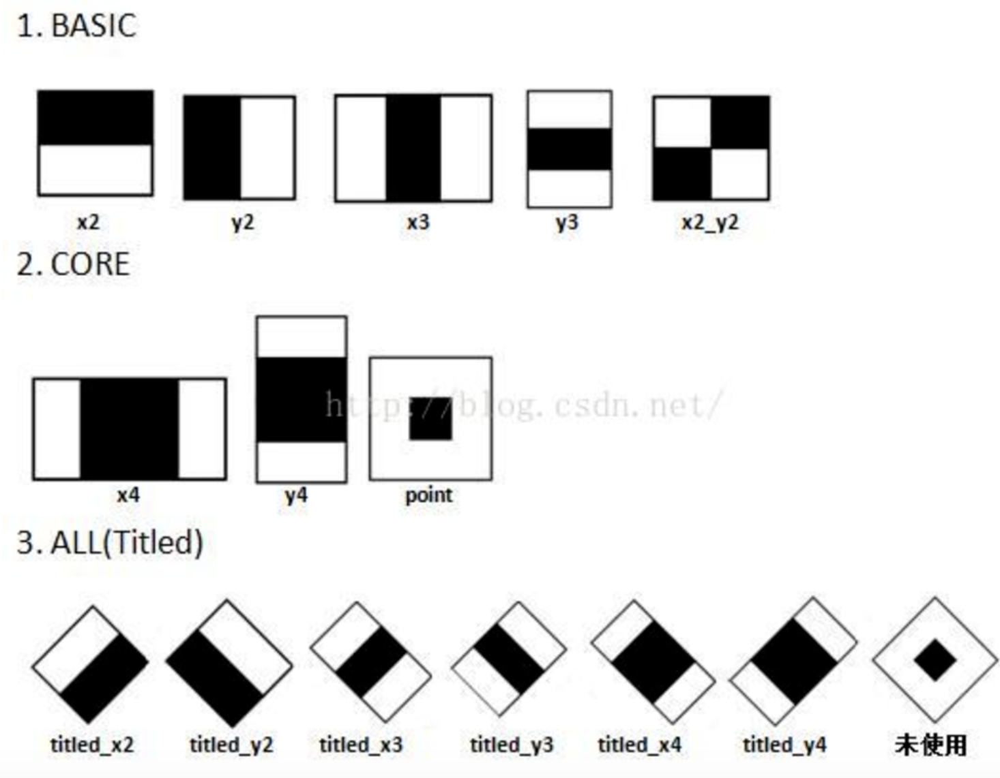
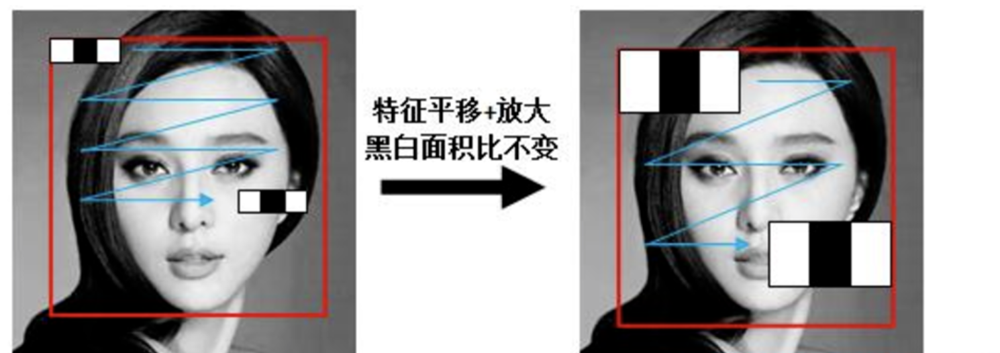
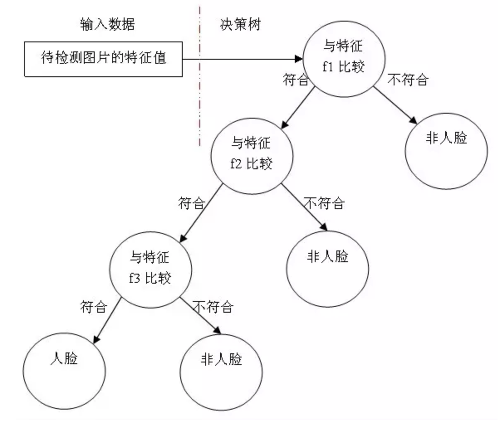
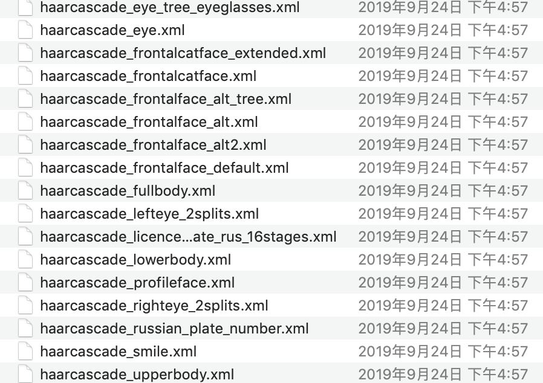
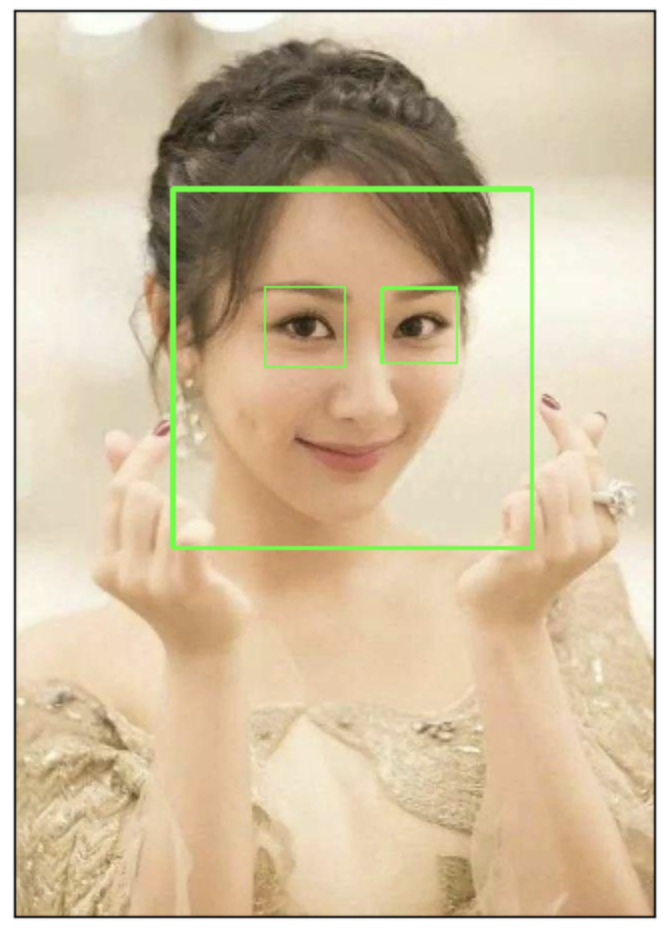

# 案例:人脸案例

**学习目标**

1. 了解opencv进行人脸检测的流程
2. 了解Haar特征分类器的内容

---

# 1 基础

我们使用机器学习的方法完成人脸检测，首先需要大量的正样本图像（面部图像）和负样本图像（不含面部的图像）来训练分类器。我们需要从其中提取特征。下图中的 Haar 特征会被使用，就像我们的卷积核，每一个特征是一 个值，这个值等于黑色矩形中的像素值之后减去白色矩形中的像素值之和。



Haar特征值反映了图像的灰度变化情况。例如：脸部的一些特征能由矩形特征简单的描述，眼睛要比脸颊颜色要深，鼻梁两侧比鼻梁颜色要深，嘴巴比周围颜色要深等。

Haar特征可用于于图像任意位置，大小也可以任意改变，所以矩形特征值是矩形模版类别、矩形位置和矩形大小这三个因素的函数。故类别、大小和位置的变化，使得很小的检测窗口含有非常多的矩形特征。



得到图像的特征后，训练一个决策树构建的adaboost级联决策器来识别是否为人脸。



# 2.实现

OpenCV中自带已训练好的检测器，包括面部，眼睛，猫脸等，都保存在XML文件中，我们可以通过以下程序找到他们：

```python
import cv2 as cv
print(cv.__file__)
```

找到的文件如下所示：



那我们就利用这些文件来识别人脸，眼睛等。检测流程如下：

1. 读取图片，并转换成灰度图

2. 实例化人脸和眼睛检测的分类器对象

   ```python
   # 实例化级联分类器
   classifier =cv.CascadeClassifier( "haarcascade_frontalface_default.xml" ) 
   # 加载分类器
   classifier.load('haarcascade_frontalface_default.xml')
   ```

3. 进行人脸和眼睛的检测

   ```python
   rect = classifier.detectMultiScale(gray, scaleFactor, minNeighbors, minSize,maxsize) 
   ```

   参数：

   - Gray: 要进行检测的人脸图像
   - scaleFactor: 前后两次扫描中，搜索窗口的比例系数
   - minneighbors：目标至少被检测到minNeighbors次才会被认为是目标
   - minsize和maxsize: 目标的最小尺寸和最大尺寸

4. 将检测结果绘制出来就可以了。


主程序如下所示：

```python
import cv2 as cv
import matplotlib.pyplot as plt
# 1.以灰度图的形式读取图片
img = cv.imread("16.jpg")
gray = cv.cvtColor(img,cv.COLOR_BGR2GRAY)

# 2.实例化OpenCV人脸和眼睛识别的分类器 
face_cas = cv.CascadeClassifier( "haarcascade_frontalface_default.xml" ) 
face_cas.load('haarcascade_frontalface_default.xml')

eyes_cas = cv.CascadeClassifier("haarcascade_eye.xml")
eyes_cas.load("haarcascade_eye.xml")

# 3.调用识别人脸 
faceRects = face_cas.detectMultiScale( gray, scaleFactor=1.2, minNeighbors=3, minSize=(32, 32)) 
for faceRect in faceRects: 
    x, y, w, h = faceRect 
    # 框出人脸 
    cv.rectangle(img, (x, y), (x + h, y + w),(0,255,0), 3) 
    # 4.在识别出的人脸中进行眼睛的检测
    roi_color = img[y:y+h, x:x+w]
    roi_gray = gray[y:y+h, x:x+w]
    eyes = eyes_cas.detectMultiScale(roi_gray) 
    for (ex,ey,ew,eh) in eyes:
        cv.rectangle(roi_color,(ex,ey),(ex+ew,ey+eh),(0,255,0),2)
# 5. 检测结果的绘制
plt.figure(figsize=(8,6),dpi=100)
plt.imshow(img[:,:,::-1]),plt.title('检测结果')
plt.xticks([]), plt.yticks([])
plt.show()
```

结果：



我们也可在视频中对人脸进行检测：

```python
import cv2 as cv
import matplotlib.pyplot as plt
# 1.读取视频
cap = cv.VideoCapture("movie.mp4")
# 2.在每一帧数据中进行人脸识别
while(cap.isOpened()):
    ret, frame = cap.read()
    if ret==True:
        gray = cv.cvtColor(frame, cv.COLOR_BGR2GRAY)
        # 3.实例化OpenCV人脸识别的分类器 
        face_cas = cv.CascadeClassifier( "haarcascade_frontalface_default.xml" ) 
        face_cas.load('haarcascade_frontalface_default.xml')
        # 4.调用识别人脸 
        faceRects = face_cas.detectMultiScale(gray, scaleFactor=1.2, minNeighbors=3, minSize=(32, 32)) 
        for faceRect in faceRects: 
            x, y, w, h = faceRect 
            # 框出人脸 
            cv.rectangle(frame, (x, y), (x + h, y + w),(0,255,0), 3) 
        cv.imshow("frame",frame)
        if cv.waitKey(1) & 0xFF == ord('q'):
            break
# 5. 释放资源
cap.release()  
cv.destroyAllWindows()
```

---

**总结**

opencv中人脸识别的流程是：

1. 读取图片，并转换成灰度图

2. 实例化人脸和眼睛检测的分类器对象

```python
# 实例化级联分类器
classifier =cv.CascadeClassifier( "haarcascade_frontalface_default.xml" ) 
# 加载分类器
classifier.load('haarcascade_frontalface_default.xml')
```

3. 进行人脸和眼睛的检测

```python
rect = classifier.detectMultiScale(gray, scaleFactor, minNeighbors, minSize,maxsize) 
```

4. 将检测结果绘制出来就可以了。

我们也可以在视频中进行人脸识别