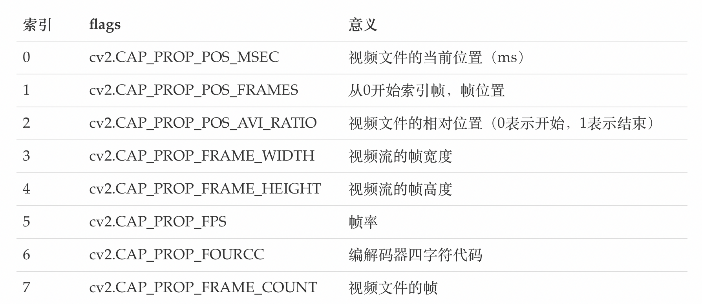

# 视频读写

**学习目标**

- 掌握读取视频文件，显示视频，保存视频文件的方法

---

# 1 从文件中读取视频并播放

在OpenCV中我们要获取一个视频，需要创建一个VideoCapture对象，指定你要读取的视频文件：

1. 创建读取视频的对象

   ```python
   cap = cv.VideoCapture(filepath)
   ```

   参数：

   - filepath: 视频文件路径

2. 视频的属性信息

   2.1.  获取视频的某些属性，

   ```python
   retval = cap.get(propId)
   ```

   参数：

   - propId: 从0到18的数字，每个数字表示视频的属性

     常用属性有：

     

   2.2 修改视频的属性信息

   ```python
   cap.set(propId，value) 
   ```

   参数：

   - proid: 属性的索引，与上面的表格相对应
   - value: 修改后的属性值

3. 判断图像是否读取成功

   ```python
   isornot = cap.isOpened()
   ```

   - 若读取成功则返回true，否则返回False

4. 获取视频的一帧图像

   ```python
   ret, frame = cap.read()
   ```

   参数：

   - ret: 若获取成功返回True，获取失败，返回False
   - Frame: 获取到的某一帧的图像

5. 调用cv.imshow()显示图像，在显示图像时使用cv.waitkey()设置适当的持续时间，如果太低视频会播放的非常快，如果太高就会播放的非常慢，通常情况下我们设置25ms就可以了。

6. 最后，调用cap.realease()将视频释放掉

示例：

```python
import numpy as np
import cv2 as cv
# 1.获取视频对象
cap = cv.VideoCapture('DOG.wmv')
# 2.判断是否读取成功
while(cap.isOpened()):
    # 3.获取每一帧图像
    ret, frame = cap.read()
    # 4. 获取成功显示图像
    if ret == True:
        cv.imshow('frame',frame)
    # 5.每一帧间隔为25ms
    if cv.waitKey(25) & 0xFF == ord('q'):
        break
# 6.释放视频对象
cap.release()
cv.destoryAllwindows()
```

# 2 保存视频

在OpenCV中我们保存视频使用的是VedioWriter对象，在其中指定输出文件的名称，如下所示：

1. 创建视频写入的对象

```python
out = cv2.VideoWriter(filename,fourcc, fps, frameSize)
```

参数：

- filename：视频保存的位置
-  fourcc：指定视频编解码器的4字节代码  
- fps：帧率
- frameSize：帧大小

2. 设置视频的编解码器，如下所示，

   ```
   retval = cv2.VideoWriter_fourcc( c1, c2, c3, c4 )
   ```

   参数：

   - c1,c2,c3,c4: 是视频编解码器的4字节代码，在[fourcc.org](http://www.fourcc.org/codecs.php)中找到可用代码列表，与平台紧密相关，常用的有：

      ###### 在Windows中：DIVX（.avi）

      ###### 在OS中：MJPG（.mp4），DIVX（.avi），X264（.mkv）。

3. 利用cap.read()获取视频中的每一帧图像，并使用out.write()将某一帧图像写入视频中。

4. 使用cap.release()和out.release()释放资源。

示例：

```python
import cv2 as cv
import numpy as np

# 1. 读取视频
cap = cv.VideoCapture("DOG.wmv")

# 2. 获取图像的属性（宽和高，）,并将其转换为整数
frame_width = int(cap.get(3))
frame_height = int(cap.get(4))

# 3. 创建保存视频的对象，设置编码格式，帧率，图像的宽高等
out = cv.VideoWriter('outpy.avi',cv.VideoWriter_fourcc('M','J','P','G'), 10, (frame_width,frame_height))
while(True):
    # 4.获取视频中的每一帧图像
    ret, frame = cap.read()
    if ret == True: 
        # 5.将每一帧图像写入到输出文件中
        out.write(frame)
    else:
        break 

# 6.释放资源
cap.release()
out.release()
cv.destroyAllWindows()
```

---

**总结**

1. 读取视频：

   - 读取视频：cap =  cv.VideoCapture()

   - 判断读取成功：cap.isOpened()

   - 读取每一帧图像：ret,frame = cap.read()

   - 获取属性：cap.get(proid)
   - 设置属性：cap.set(proid,value)
   - 资源释放：cap.release()

2. 保存视频
   - 保存视频： out = cv.VideoWrite()
   - 视频写入：out.write()
   - 资源释放：out.release()